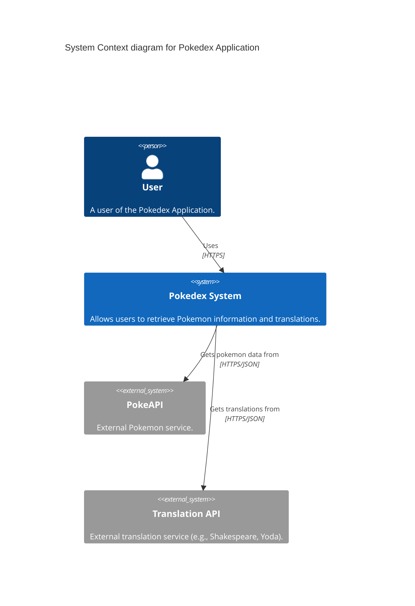
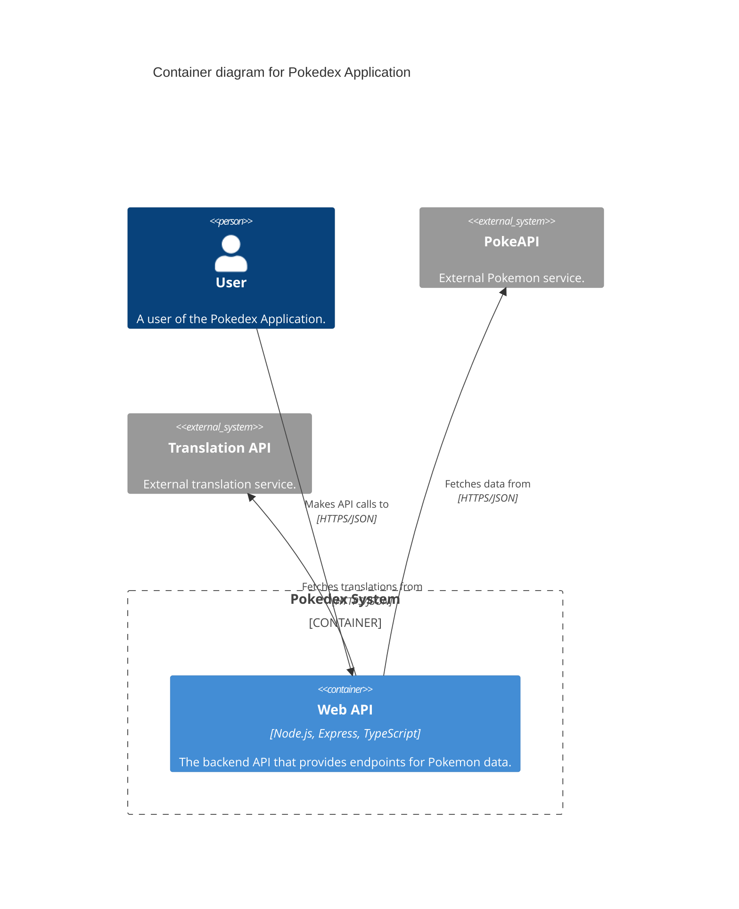
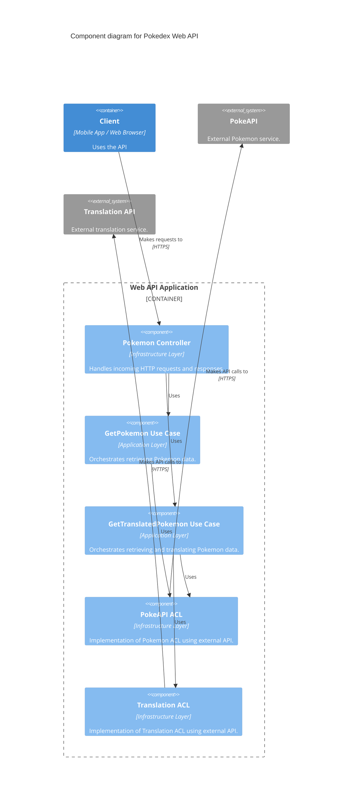

# C4 Architecture Diagrams

## Level 1: System Context Diagram

This diagram shows the software system in the context of the people and other software systems it interacts with.

## Level 2: Container Diagram

This diagram shows the high-level shape of the software architecture and how responsibilities are distributed across it.

## Level 3: Component Diagram

This diagram shows how the Web API container is made up of a number of "components". It follows the Clean Architecture layers.

