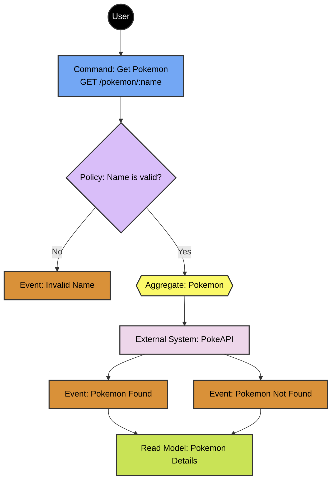
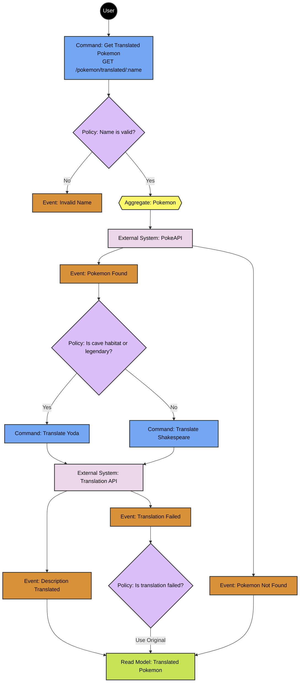

# Event Storming

## Legend

```mermaid
graph TD
    %% Legend
    classDef command fill:#73a7f4,stroke:#333,stroke-width:2px,color:black;
    classDef event fill:#d99139,stroke:#333,stroke-width:2px,color:black;
    classDef system fill:#edd6ea,stroke:#333,stroke-width:2px,color:black;
    classDef readmodel fill:#c9e356,stroke:#333,stroke-width:2px,color:black;
    classDef policy fill:#d9bef9,stroke:#333,stroke-width:2px,color:black;
    classDef aggregate fill:#fbf969,stroke:#333,stroke-width:2px,color:black;
    classDef user fill:#000000,stroke:#333,stroke-width:2px,color:white;
    Command[Command]:::command
    Event[Event]:::event
    System[External System]:::system
    ReadModel[Read Model]:::readmodel
    Policy[Policy]:::policy
    Aggregate[Aggregate]:::aggregate
    User[User]:::user
```

## Get Pokemon Info

```mermaid
graph TD
    %% Legend
    classDef command fill:#73a7f4,stroke:#333,stroke-width:2px,color:black;
    classDef event fill:#d99139,stroke:#333,stroke-width:2px,color:black;
    classDef system fill:#edd6ea,stroke:#333,stroke-width:2px,color:black;
    classDef readmodel fill:#c9e356,stroke:#333,stroke-width:2px,color:black;
    classDef policy fill:#d9bef9,stroke:#333,stroke-width:2px,color:black;
    classDef aggregate fill:#fbf969,stroke:#333,stroke-width:2px,color:black;
    classDef user fill:#000000,stroke:#333,stroke-width:2px,color:white;
    User((User)):::user
    CmdGet[Command: Get Pokemon<br/>GET /pokemon/:name]:::command
    PolicyVal1{Policy: Name is valid?}:::policy
    ErrInv1[Event: Invalid Name]:::event
    AggPokemon1{{Aggregate: Pokemon}}:::aggregate
    ExtPokeAPI[External System: PokeAPI]:::system
    EvtPokeFound[Event: Pokemon Found]:::event
    EvtPokeNotFound[Event: Pokemon Not Found]:::event
    RM_Poke[Read Model: Pokemon Details]:::readmodel
    User --> CmdGet
    CmdGet --> PolicyVal1
    PolicyVal1 -- No --> ErrInv1
    PolicyVal1 -- Yes --> AggPokemon1
    AggPokemon1 --> ExtPokeAPI
    ExtPokeAPI --> EvtPokeFound
    ExtPokeAPI --> EvtPokeNotFound
    EvtPokeFound --> RM_Poke
    EvtPokeNotFound --> RM_Poke
```

## Get Translated Pokemon Info

```mermaid
graph TD
    %% Legend
    classDef command fill:#73a7f4,stroke:#333,stroke-width:2px,color:black;
    classDef event fill:#d99139,stroke:#333,stroke-width:2px,color:black;
    classDef system fill:#edd6ea,stroke:#333,stroke-width:2px,color:black;
    classDef readmodel fill:#c9e356,stroke:#333,stroke-width:2px,color:black;
    classDef policy fill:#d9bef9,stroke:#333,stroke-width:2px,color:black;
    classDef aggregate fill:#fbf969,stroke:#333,stroke-width:2px,color:black;
    classDef user fill:#000000,stroke:#333,stroke-width:2px,color:white;
    User((User)):::user
    CmdGetTrans[Command: Get Translated Pokemon<br/>GET /pokemon/translated/:name]:::command
    PolicyVal1{Policy: Name is valid?}:::policy
    ErrInv1[Event: Invalid Name]:::event
    AggPokemon1{{Aggregate: Pokemon}}:::aggregate
    ExtPokeAPI[External System: PokeAPI]:::system
    EvtPokeFound[Event: Pokemon Found]:::event
    EvtPokeNotFound[Event: Pokemon Not Found]:::event
    LogicTransType{Policy: Is cave habitat or legendary?}:::policy
    CmdTransYoda[Command: Translate Yoda]:::command
    CmdTransShake[Command: Translate Shakespeare]:::command
    ExtTransAPI[External System: Translation API]:::system
    EvtTransSuccess[Event: Description Translated]:::event
    EvtTransFail[Event: Translation Failed]:::event
    PolicyFallback{Policy: Is translation failed?}:::policy
    RM_Trans[Read Model: Translated Pokemon]:::readmodel
    User --> CmdGetTrans
    CmdGetTrans --> PolicyVal1
    PolicyVal1 -- No --> ErrInv1
    PolicyVal1 -- Yes --> AggPokemon1
    AggPokemon1 --> ExtPokeAPI
    ExtPokeAPI --> EvtPokeNotFound
    ExtPokeAPI --> EvtPokeFound
    EvtPokeFound --> LogicTransType
    LogicTransType -- Yes --> CmdTransYoda
    LogicTransType -- No --> CmdTransShake
    CmdTransYoda --> ExtTransAPI
    CmdTransShake --> ExtTransAPI
    ExtTransAPI --> EvtTransSuccess
    ExtTransAPI --> EvtTransFail
    EvtTransSuccess --> RM_Trans
    EvtTransFail --> PolicyFallback
    PolicyFallback -- Use Original --> RM_Trans
    EvtPokeNotFound --> RM_Trans
```
